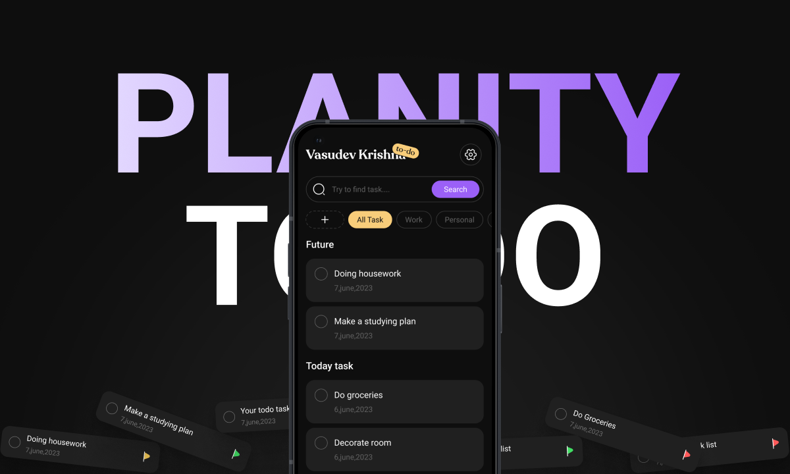

# Planity 📝✨

<p align="center">
  
</p>

<p align="center">
  <strong>A modern, feature-rich to-do and task management application for Android.</strong>
  <br/>
  Built with a focus on clean architecture, a beautiful user experience, and robust, real-time data synchronization with Firebase.
</p>
---

## 🌟 Features

Planity is more than just a to-do list. It's a complete productivity companion designed to be both powerful and delightful to use.

-   **🔐 Secure Authentication**: Fast and secure user sign-up and login with Email & Password, powered by Firebase Auth.
-   **👤 Private, User-Specific Data**: Every user's tasks and categories are stored securely and are only accessible to them, thanks to a multi-user Firestore structure.
-   **✅ Advanced Task Management**:
    -   Create tasks with titles, categories, and priority levels.
    -   Edit any task detail on a dedicated, modern info screen.
    -   Mark tasks as complete, moving them to a special, expandable "Completed" section.
    -   "Delete" tasks by moving them to a "Trash" category, preventing accidental data loss.
-   **🗂️ Dynamic Category System**:
    -   Create and manage custom categories to organize your life.
    -   **Intuitive Drag-and-Drop Reordering**: Effortlessly reorder your category list. The new order is saved and synced in real-time.
-   **🔍 Powerful Filtering & Search**:
    -   Instantly find tasks by title.
    -   Filter your view by any category, including dedicated filters for "All Active Tasks", "Completed", and "Trash".
-   **📊 Productivity Dashboard**:
    -   A beautiful **Graph Screen** visualizes your task completion history over the past week.
    -   Quickly see at-a-glance stats for your pending and completed tasks.
-   **🚀 Seamless Onboarding**: A smooth, one-time onboarding flow for new users.
-   **✨ Modern UI/UX**:
    -   Built entirely with Jetpack Compose and Material 3 design principles.
    -   Smooth, fluid animations and transitions for navigation and UI state changes.

---

## 🏛️ Architecture & Tech Stack

This project is a showcase of modern Android development best practices, built upon a solid **Clean Architecture** foundation. This makes the app highly testable, scalable, and easy to maintain.

-   **Core Language**: 100% **Kotlin**, leveraging Coroutines and Flow for asynchronous operations.
-   **UI**: **Jetpack Compose** with **Material 3** for a declarative, modern, and beautiful user interface.
-   **Architecture**:
    -   **Clean Architecture**: Separation of concerns into `Domain`, `Data`, and `Presentation` layers.
    -   **MVI-like Pattern**: The UI follows a unidirectional data flow pattern (State, Events, ViewModel).
    -   **[Koin](https://insert-koin.io/)**: For pragmatic and simple dependency injection.
-   **Navigation**:
    -   **[Jetpack Navigation Compose](https://developer.android.com/jetpack/compose/navigation)** for a robust, single-activity navigation graph.
    -   Handles screen navigation, bottom sheets, and dialogs seamlessly.
-   **Backend & Data**:
    -   **[Firebase Authentication](https://firebase.google.com/docs/auth)** for user management.
    -   **[Firebase Firestore](https://firebase.google.com/docs/firestore)** as the real-time, multi-user NoSQL database.
    -   **[DataStore](https://developer.android.com/topic/libraries/architecture/datastore)** for persisting the user's onboarding status locally.

---

## 🌐 Coming Soon: Full Multiplatform Support!

The foundation of this application was built with the future in mind. The strict adherence to Clean Architecture, with a pure Kotlin `domain` layer, has paved the way for an exciting evolution.

**The next major version of Planity will be a full [Compose Multiplatform](https://www.jetbrains.com/lp/compose-multiplatform/) application, sharing code across Android and iOS.**

-   ✅ **Domain Layer**: 100% ready to be shared.
-   ✅ **Data Layer**: The repository implementation will be refactored to use the Firebase KMP SDK.
-   ✅ **Presentation Layer**: ViewModels will be migrated to a KMP-compatible solution (like Voyager's `ScreenModel`), and the UI, built with Compose, is already largely shareable.

Stay tuned for a truly cross-platform Planity experience!

---

## 🚀 Getting Started

To build and run the current Android version of the project, follow these steps:

1.  **Clone the Repository**
    ```bash
    git clone https://github.com/mxd0-0/planity.git
    ```

2.  **Firebase Setup**
    -   Go to the [Firebase Console](https://console.firebase.google.com/) and create a new project.
    -   Add a new Android app to the project with the package name: `com.mohammed.planity`.
    -   In the **Authentication** section, enable the **Email/Password** sign-in provider.
    -   In the **Firestore Database** section, create a new database.
    -   Download the generated `google-services.json` file.
    -   Place the `google-services.json` file into the **`app/`** directory of the project.

3.  **Build and Run**
    -   Open the project in the latest version of Android Studio.
    -   Let Gradle sync the dependencies.
    -   Build and run the app on an emulator or a physical device.

You're all set! You can now create an account and start planning.
